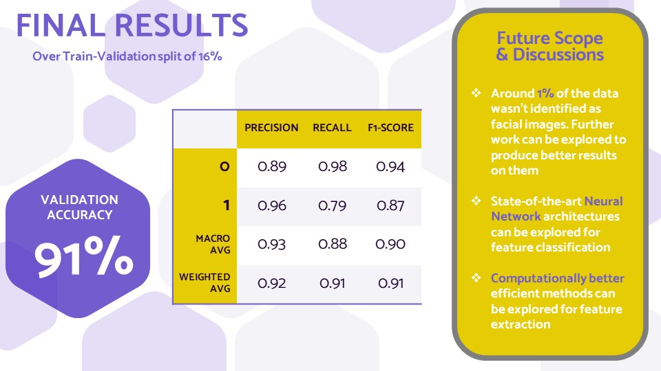

# AI-Hackathon

### File Structure
- [ExecutiveSummary.pptx](./ExecutiveSummary.pptx) : Executive Summary Report
- [FinalSubmission.ipynb](./FinalSubmission.ipynb) : Clean ipynb file showing flow of work
- [finalized_model.sav](./finalized_model.sav) : Model
- [testPred.csv](./testPred.csv) : CSV file containing outputs of 5000 hidden data images from test.csv
- [run.py](./run.py) : File to generate testPred.csv for any given input test.csv
- [requirements.txt](./requirements.txt)

### Assumptions and procedure for run.py execution

- `test.csv` should be present in the same folder as `run.py`
- output file generated will be `testPred.csv` located in the same folder as `run.py`
- fileformat for input of images should be same as `test.csv`
- images should have a relative location of `./dataset_images/` with respect to `run.py`

### Overview

